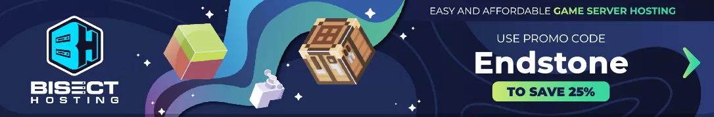

<div align="center">
  <a href="https://github.com/EndstoneMC/endstone/releases">
    
  </a>

<h3>Endstone</h3>

<p> 
  <b>高性能的Minecraft基岩版服务器插件</b><br>
  可扩展的 Python 和 C++ 插件
</p>

---

[English](README.md)

---

[](https://github.com/EndstoneMC/endstone/actions/workflows/build.yml)
[-black)](https://feedback.minecraft.net/hc/en-us/sections/360001186971-Release-Changelogs)
[](https://pypi.org/project/endstone)
[](https://www.python.org/)
[](LICENSE)
[](https://discord.gg/xxgPuc2XN9)
[](https://cloudsmith.io/~endstone/repos/conan/packages/)

</div>

## 为什么选择 Endstone?

基岩版的官方插件和脚本API允许您添加内容，但几乎无法修改核心游戏玩法。PocketMine和Nukkit等定制服务器提供了这种修改，但牺牲了原生功能。Endstone则同时提供你所有：可取消的事件、数据包控制和深度游戏访问，并具有完全的原生兼容性。把它想象成一篇基岩版的论文。如果你曾希望基岩版服务器具有与Java版相同的修改能力，那么这就是你所期待的插件。

## 快速部署

让你的服务器运行几秒:

```shell
pip install endstone
endstone
```

然后创建你的第一个插件:

```python
from endstone.plugin import Plugin
from endstone.event import event_handler, PlayerJoinEvent


class MyPlugin(Plugin):
    api_version = "0.10"

    def on_enable(self):
        self.logger.info("MyPlugin enabled!")
        self.register_events(self)

    @event_handler
    def on_player_join(self, event: PlayerJoinEvent):
        event.player.send_message(f"Welcome, {event.player.name}!")
```

**从我们的模版中学习:**
[Python](https://github.com/EndstoneMC/python-plugin-template) | [C++](https://github.com/EndstoneMC/cpp-plugin-template)

## 特点

- **跨平台** - 在Windows和Linux上原生运行，无需模拟器，部署灵活且简单。

- **始终最新** - 始终与最新的Minecraft基岩版发布保持兼容的设计，确保您不会落后。

- **Python与C++插件** - 使用Python编写快速开发的插件，或在需要最高性能时使用C++，选择权在您手中。

- **强大的API** - 全面的API，包含60多个事件，涵盖玩家、方块、角色等。支持命令、表单、记分板、物品栏以及完整的权限系统。

- **即换即用替换方案** - 与您现有的Bedrock世界和配置兼容。只需安装并运行即可。

- **对Bukkit开发者友好** - 如果你曾为Java版服务器开发过插件，你会对Endstone的API设计感到非常熟悉。

## 配置

要求在Windows 10及以上版本或Linux（Ubuntu 22.04及以上版本，Debian 12及以上版本）上使用Python 3.10或更高版本。

### 使用 pip (推荐)

```shell
pip install endstone
endstone
```

### 使用 Docker

```shell
docker pull endstone/endstone
docker run --rm -it -p 19132:19132/udp endstone/endstone
```

### 从源代码构建

```shell
git clone https://github.com/EndstoneMC/endstone.git
cd endstone
pip install .
endstone
```

您也可以查看我们的[文档](https://endstone.dev/)，了解详细的安装指南、系统要求以及配置选项。

## 文档

 访问[endstone.dev](https://endstone.dev/) 来查看指南，教程和API。

## 贡献

我们欢迎贡献者! 无论是错误报告、功能请求还是代码贡献:

- **找到一个bug?** 提出 [issue](https://github.com/EndstoneMC/endstone/issues)
- **想要贡献代码?** 提交 [pull request](https://github.com/EndstoneMC/endstone/pulls)
- **想要支持项目?** [Buy me a coffee](https://ko-fi.com/EndstoneMC)

## 许可

Endstone根据[Apache-2.0许可证](LICENSE)授权。

## 致谢

endstone由以下赞助商支持， [Bisect Hosting](https://bisecthosting.com/endstone)， 它提供了托管Minecraft服务器的主机服务。

[](https://bisecthosting.com/endstone)

软件包仓库托管服务由以下机构提供， [Cloudsmith](https://cloudsmith.com)，为开源项目提供了免费的软件包管理服务。

[](https://cloudsmith.com)
