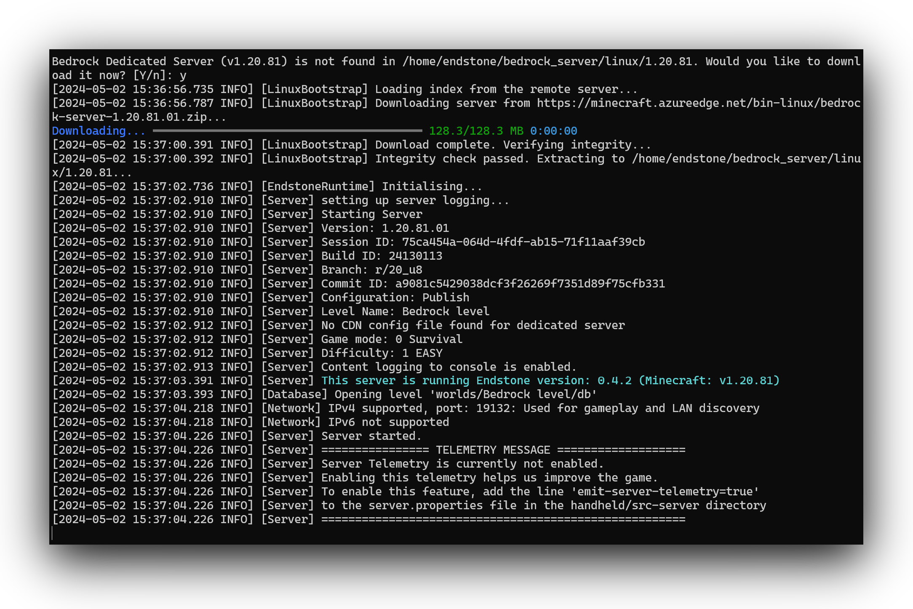

# Start your server

After you've [installed] Endstone, you can bootstrap your server using the `endstone` executable. Go to the directory
where you want your server to be located and enter:

```
endstone
```

Alternatively, if you're running Endstone from within Docker, use:

=== ":fontawesome-brands-linux: Linux / :fontawesome-brands-windows: PowerShell"

    ```
    docker run --rm -it -v ${PWD}/data:/data -p 19132:19132/udp -p 19133:19133/udp endstone/endstone
    ```

=== ":fontawesome-brands-windows: Command Prompt"

    ```
    docker run --rm -it -v "%cd%\data":/data -p 19132:19132/udp -p 19133:19133/udp endstone/endstone
    ```

=== ":fontawesome-brands-linux: Linux / :fontawesome-brands-apple: macOS / :fontawesome-solid-microchip: with emulation"

    ```
    docker run \
    --platform linux/amd64 \
    -p 19132:19132/udp \
    -p 19133:19133/udp \
    -it \
    -v ${PWD}/data:/data \
    --name endstone-server \
    endstone/endstone
    ```

    Note that if you are on an `x86-64` machine and you are not on macOS or Windows, emulation will not apply.

The container keeps the world, plugins and configuration in the mounted `data` directory, so
your server survives being recreated. Set the `PUID`/`PGID` environment variables (e.g.
`-e PUID=1000 -e PGID=1000`) to your host user so the files stay writable.

If you prefer [Docker Compose], create a `docker-compose.yml` next to your `data` directory:

```yaml
services:
  endstone:
    image: endstone/endstone:latest
    restart: unless-stopped
    stdin_open: true
    tty: true
    stop_grace_period: 60s
    ports:
      - "19132:19132/udp"
      - "19133:19133/udp"
    volumes:
      - ./data:/data
```

and start the server with `docker compose up -d`.

You should see this in your console:



!!! tip
    The first time you run the bootstrap, it will need to download the [Bedrock Dedicated Server] from the official
    mirror. Press ++y++ and ++enter++ to continue.


[installed]: installation.md

[Bedrock Dedicated Server]: https://www.minecraft.net/en-us/download/server/bedrock

[Docker Compose]: https://docs.docker.com/compose/