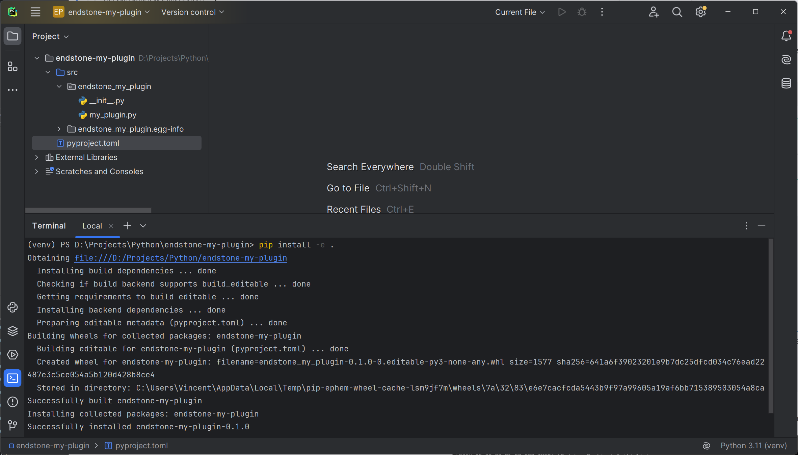

=== ":fontawesome-brands-python: Python"

    To install your first plugin in Python, click on the :octicons-terminal-16: icon on
    the side bar to open the terminal and type:
    ```
    pip install -e .
    ```
    
    !!! tip
        `-e` means to install the python package in **editable** mode which allows any changes in the source code to be
        effective immediately without the need to use `pip install` again.

    You should see something like this in your console:

    

=== ":simple-cplusplus: C++"

    Before installing your first plugin, you will need to build it.

    
    
    Then, copy the built shared library to the plugins folder `path/to/bedrock_server/plugins`.

    !!! tip
        For example, if you are running Endstone server for Minecraft 1.20.81 on Windows. To install the plugin, copy
        `endstone_my_plugin.dll` to `endstone/bedrock_server/windows/1.20.81/plugins`.

Now, [start your server] again. You should see your plugin has been successfully loaded.


**:partying_face: Congratulations!** You've made your first plugin for Endstone servers!

[start your server]: ../getting-started/start-your-server.md