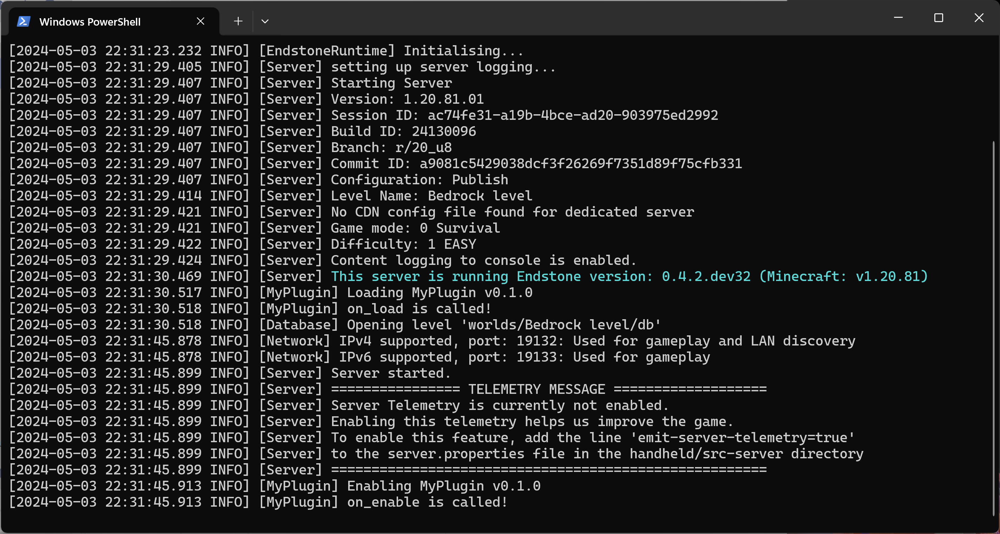

Before installing your first plugin, you will need to build it.

=== ":fontawesome-brands-python: Python"

    Click on the :octicons-terminal-16: icon on the side bar to open the 
    terminal and type:

    ```bash
    pip install pipx
    pipx run build --wheel
    ```

    You should see something like this in your console:

    

    Then, copy the built wheel package `endstone_my_plugin.whl` under the `dist`
    folder to the plugins folder `path/to/bedrock_server/plugins`.

=== ":simple-cplusplus: C++"

    Click on the menu icon on the top bar and select **Build > Build Project** 
    to build your plugin.

    
    
    Then, copy the built shared library `endstone_my_plugin.dll` to the plugins 
    folder `path/to/bedrock_server/plugins`.

Now, [start your server] again. You should see your plugin has been successfully
loaded.



**:partying_face: Congratulations!** You've made your first plugin for Endstone
servers!

[start your server]: ../getting-started/start-your-server.md