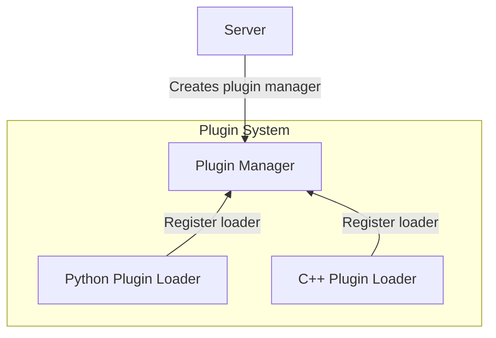
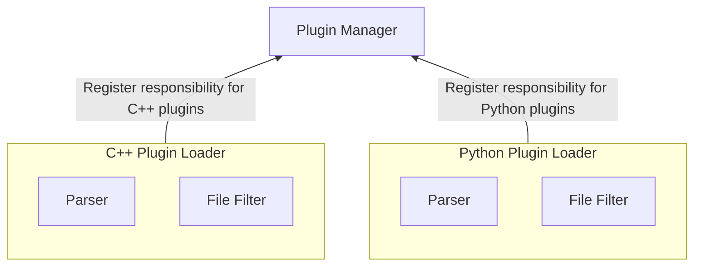
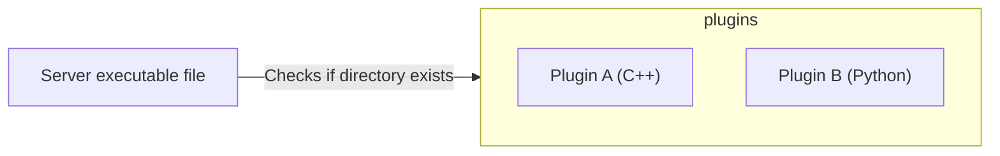
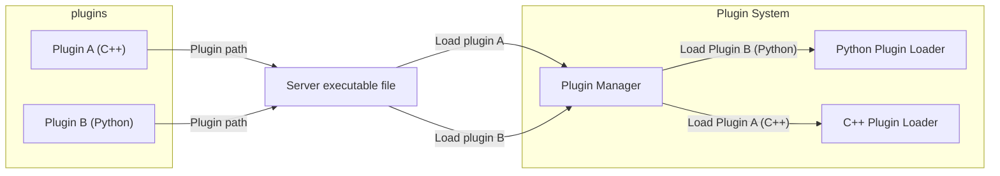
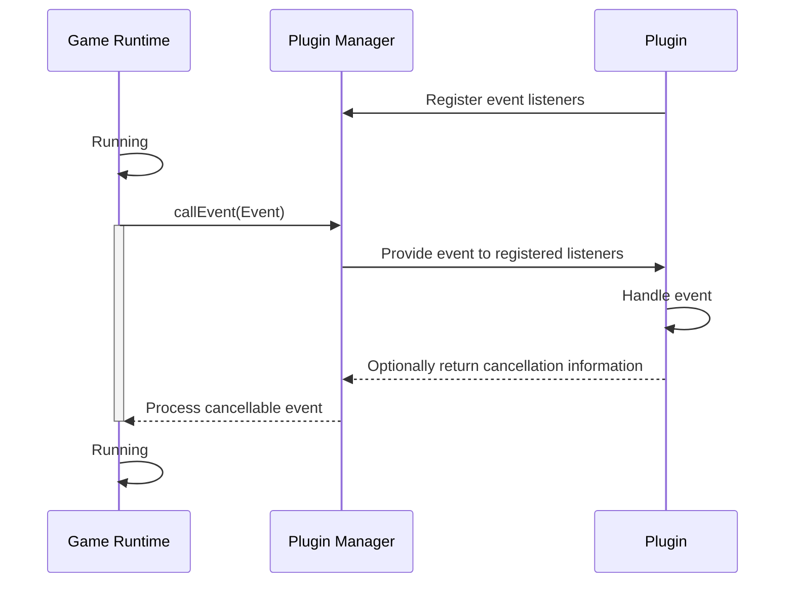

# Plugins Deep Dive

How does Endstone load and run your plugins?

## Registration

At a high level, the Endstone server first creates the plugin manager. The manager then registers the C++ and Python plugin loaders.

Each plugin loader defines what files they parse, and how to parse them. This information is passed during registration.

## Loading

The server now looks for a `plugins` directory to load plugins from.

When the server finds plugins in that directory, it calls the manager to load them.

!!! note 

    This is not what's exactly done in the source code. The logic for scanning a directory belongs to the plugin manager.

## Runtime

Once the server is running, in-game events are passed to the loaded plugins for handling and optional cancellation, if the event is cancellable.

